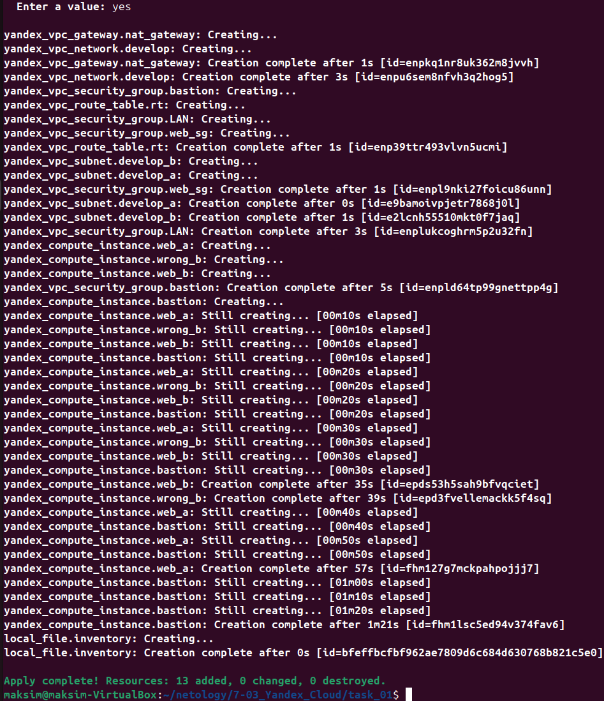
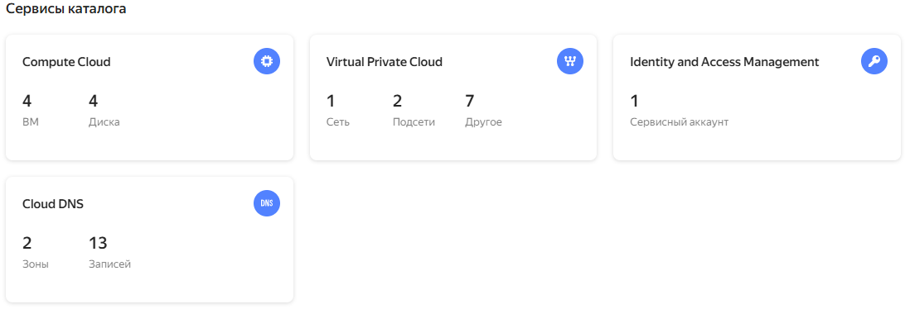
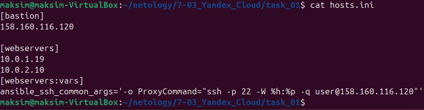
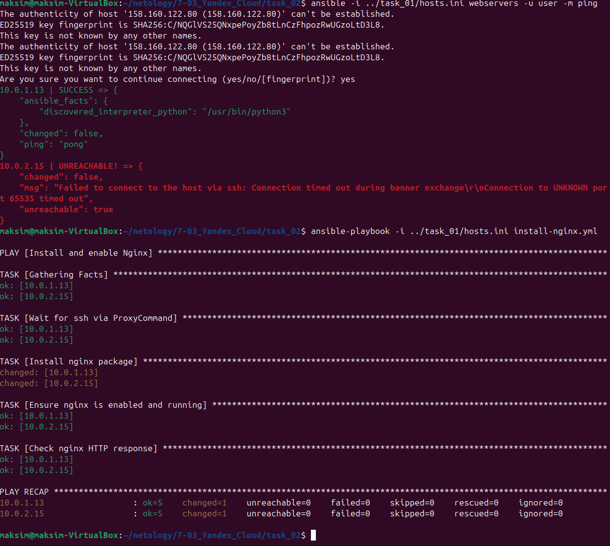
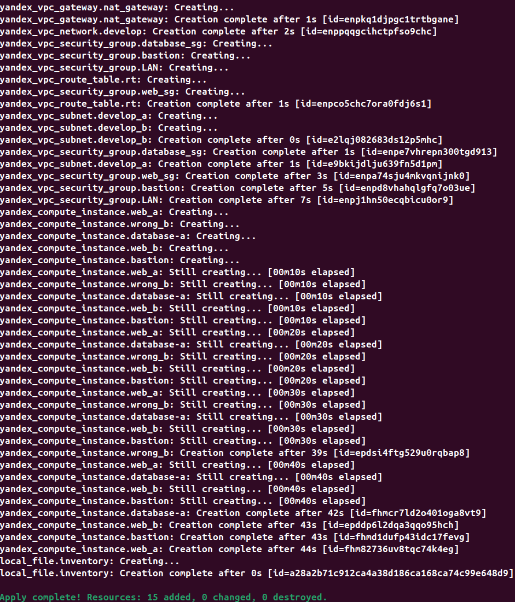
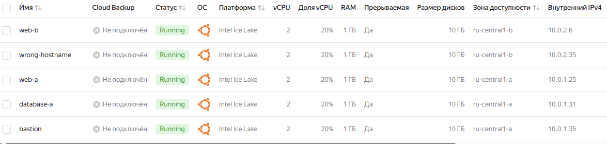
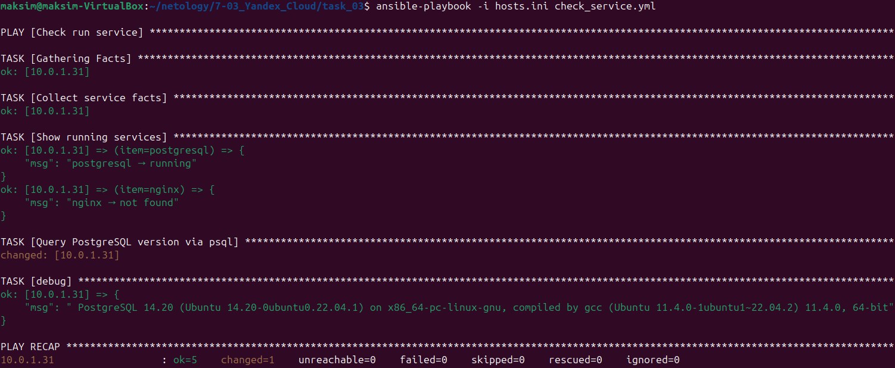

# Домашнее задание к занятию "Подъём инфраструктуры в Yandex Cloud" - Клочек Максим

### Задание 1 

Повторить демонстрацию лекции(развернуть vpc, 2 веб сервера, бастион сервер)

`Приведите ответ в свободной форме........`

---

Конец вывода `terraform init && terraform apply`

`

Результат в облаке

`

созданный файл host.ini

`

---

### Задание 2 

С помощью ansible подключиться к web-a и web-b , установить на них nginx.(написать нужный ansible playbook)

Провести тестирование и приложить скриншоты развернутых в облаке ВМ, успешно отработавшего ansible playbook. 

`Приведите ответ в свободной форме........`

---

Чтоб на первом проходе в плэйбуке небыло ошибки соеденения со 2ым хостом  надо выполнить

`ansible -i ../task_01/hosts.ini webservers -u user -m ping`

А портом

`ansible-playbook -i ../task_01/hosts.ini install-nginx.yml`

`

Я не смог победить чтоб при первом запуске после поднятия облака playbook отработал без ошибки (всегда на втором хосте была ошибка) и по этому приходилость ещё раз запускать. pre_task в playbook не помог решить проблему. Я решил что самое простое сделать пинг.

---

## Дополнительные задания* (со звёздочкой)
### Задание 3*

**Выполните действия, приложите скриншот скриптов, скриншот выполненного проекта.**

1. Добавить еще одну виртуальную машину. 
2. Установить на нее любую базу данных. 
3. Выполнить проверку состояния запущенных служб через Ansible.

`Приведите ответ в свободной форме........`

---

1. Виртуальная машина описана в файле `vms_db-task3.tf`
2. Устанавивается Postgresql через `cloud-init-bd.yml`
3. В `vms.tf` добавлена секция для базы данных при создании фала `hosts.ini` 
4. В `networks.tf` добавлено чтоб к машине с БД был доступ только по 5432 порту
5. Плэйбук для проверки в `check_service.yml`. Проверяется что запущена база данных и выполняется sql запрос версии БД. Запрос через shell чтоб не устанавливать модуль для работы с БД.
6. Проверка `ansible-playbook -i hosts.ini check_service.yml` 

Конец вывода `terraform init && terraform apply`

`

Результат в облаке

`

Проверка

`

### Задание 4*
Изучите [инструкцию](https://cloud.yandex.ru/docs/tutorials/infrastructure-management/terraform-quickstart) yandex для terraform.
Добейтесь работы паплайна с безопасной передачей токена от облака в terraform через переменные окружения. Для этого:

1. Настройте профиль для yc tools по инструкции.
2. Удалите из кода строчку "token = var.yandex_cloud_token". Terraform будет считывать значение ENV переменной YC_TOKEN.
3. Выполните команду export YC_TOKEN=$(yc iam create-token) и в том же shell запустите terraform.
4. Для того чтобы вам не нужно было каждый раз выполнять export - добавьте данную команду в самый конец файла ~/.bashrc

---